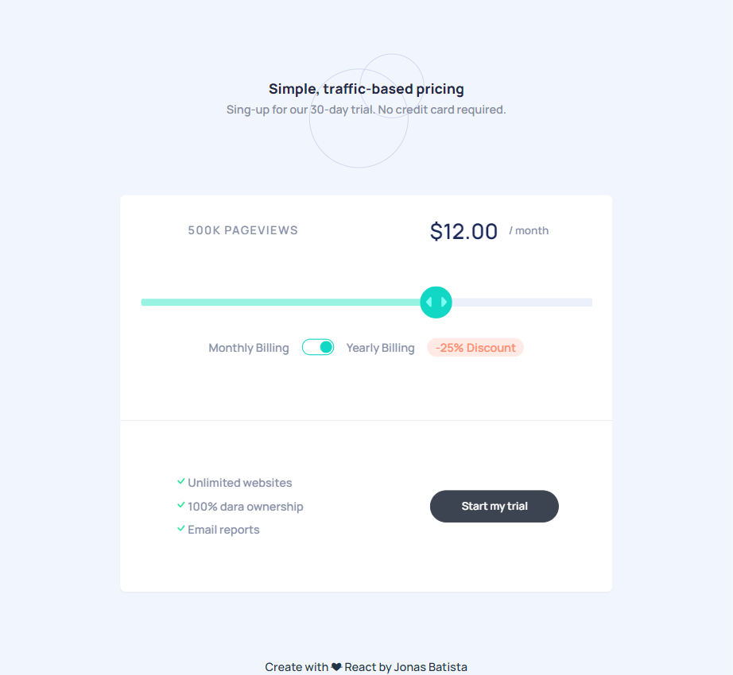

# Interactive pricing component

This is a solution to the [Interactive pricing component challenge on Frontend Mentor](https://www.frontendmentor.io/challenges/interactive-pricing-component-t0m8PIyY8). Frontend Mentor challenges help you improve your coding skills by building realistic projects.

## Table of contents

-   [Overview](#overview)
    -   [The challenge](#the-challenge)
    -   [Screenshot](#screenshot)
    -   [Links](#links)
-   [My process](#my-process)
    -   [Built with](#built-with)
    -   [What I learned](#what-i-learned)
    -   [Continued development](#continued-development)
    -   [Useful resources](#useful-resources)
-   [Author](#author)


**Note: Delete this note and update the table of contents based on what sections you keep.**

## Overview

### The challenge

Users should be able to:

-   View the optimal layout for the app depending on their device's screen size
-   See hover states for all interactive elements on the page
-   Use the slider and toggle to see prices for different page view numbers

### Screenshot



### Links

-   Solution URL: [Add solution URL here](https://your-solution-url.com)
-   Live Site URL: [Add live site URL here](https://your-live-site-url.com)

## My process

### Built with

-   Semantic HTML5 markup
-   CSS custom properties
-   Flexbox
-   CSS Grid
-   Mobile-first workflow
-   [Tailwind](https://tailwindcss.com/) - css-in-JS - For Styles
-   [React](https://reactjs.org/) - JS library
-   [Styled-components](https://styled-components.com/) - For Styles

### What I learned

I was able to learn how to customize a range type input, even putting a background in it, that was the biggest challenge.


```css
input[type='range']::-webkit-slider-thumb {
    background-image: url('../../assets/images/icon-slider.svg');
    background-repeat: no-repeat;
    background-size: 2rem;
    background-position: center;
}
```


### Continued development

This challenge served to show weaknesses in styled components, other than that it proved to be very easy to solve.

### Useful resources

useful resources 1 - put a size on the parent element for better grid control.
useful resources 2 - search stackoverflow to save timeuseful 
useful resources 3 - use more js with styled-components

## Author

-   Website - [Jonas Batista](https://meu-portfolio-plum.vercel.app/)
-   Frontend Mentor - [@jonas-nb](https://www.frontendmentor.io/profile/jonas-nb)

